# Kuberenetes-Lite Deploy 

## Project Overview

Microservice deployment on Kubernetes with auto-scaling and monitoring.

## Project Stack:
- Node.js microservice with Prometheus metrics
- Docker containerization
- Kubernetes (EKS/Kind) with HPA auto-scaling
- GitHub Actions CI/CD pipeline
- Prometheus + Grafana monitoring

## Project Structure

```bash
k8s-lite-deploy/
├── .github/
│   └── workflows/
│       └── deploy.yml
├── app/
│   ├── app.js
│   ├── package.json
│   └── Dockerfile
├── k8s/
│   ├── deployment.yaml
│   ├── service.yaml
│   └── hpa.yaml
├── monitoring/
│   ├── prometheus.yaml
│   └── grafana.yaml
├── README.md
└── architecture.md
```

### Project Tasks

**Microservice APP**

```bash
mkdir app
cd app
nano package.json
```

- Create the app/package.json:

```bash
{
  "name": "k8s-lite-service",
  "version": "1.0.0",
  "scripts": { "start": "node app.js" },
  "dependencies": {
    "express": "^4.18.2",
    "prom-client": "^15.0.0"
  }
}
```

- Create the app/app.js:

```bash
nano app.js
```

```bash
const express = require('express')
const client = require('prom-client')
const os = require('os')

const app = express()
const PORT = process.env.PORT || 3000
const registry = new client.Registry()

client.collectDefaultMetrics({ register: registry })

const httpRequests = new client.Counter({
  name: 'http_requests_total',
  help: 'Total HTTP requests',
  labelNames: ['method', 'route', 'status'],
  registers: [registry]
})

const httpDuration = new client.Histogram({
  name: 'http_request_duration_seconds',
  help: 'HTTP request duration',
  labelNames: ['method', 'route'],
  registers: [registry]
})

app.use((req, res, next) => {
  const end = httpDuration.startTimer()
  res.on('finish', () => {
    httpRequests.inc({ method: req.method, route: req.path, status: res.statusCode })
    end({ method: req.method, route: req.path })
  })
  next()
})

app.get('/', (req, res) => {
  res.json({
    message: 'K8s-Lite Microservice',
    pod: os.hostname(),
    version: process.env.APP_VERSION || '1.0.0',
    timestamp: new Date().toISOString()
  })
})

app.get('/health', (req, res) => {
  res.status(200).json({ status: 'healthy', pod: os.hostname() })
})

app.get('/metrics', async (req, res) => {
  res.set('Content-Type', registry.contentType)
  res.send(await registry.metrics())
})

app.listen(PORT, () => console.log(`Running on port ${PORT}`))
```

- Create app/Dockerfile:

```bash
nano Dockerfile
```

```bash
FROM node:20-alpine
WORKDIR /app
COPY package*.json ./
RUN npm ci --omit=dev
COPY app.js .
RUN addgroup -S appgroup && adduser -S appuser -G appgroup
USER appuser
EXPOSE 3000
HEALTHCHECK --interval=30s --timeout=10s --retries=3 \
  CMD wget -q http://localhost:3000/health || exit 1
CMD ["node", "app.js"]
```

Also note that we have to add a lock file 'package-lock.json' by running the code;

```bash
npm install
```

**Kubernetes Manifests**

- Create k8s/deployment.yaml:

```bash
mkdir k8s
cd k8s
nano deployment.yaml
```

```bash
apiVersion: apps/v1
kind: Deployment
metadata:
  name: k8s-lite-service
  labels:
    app: k8s-lite-service
spec:
  replicas: 2
  selector:
    matchLabels:
      app: k8s-lite-service
  template:
    metadata:
      labels:
        app: k8s-lite-service
      annotations:
        prometheus.io/scrape: "true"
        prometheus.io/port: "3000"
        prometheus.io/path: "/metrics"
    spec:
      imagePullSecrets:
        - name: ghcr-secret
      containers:
        - name: k8s-lite-service
          image: ghcr.io/bruyo/k8s-lite-service:latest
          ports:
            - containerPort: 3000
          env:
            - name: APP_VERSION
              value: "1.0.0"
          resources:
            requests:
              memory: "64Mi"
              cpu: "50m"
            limits:
              memory: "128Mi"
              cpu: "100m"
          livenessProbe:
            httpGet:
              path: /health
              port: 3000
            initialDelaySeconds: 10
            periodSeconds: 30
          readinessProbe:
            httpGet:
              path: /health
              port: 3000
            initialDelaySeconds: 5
            periodSeconds: 10
```

- Create k8s/service.yaml:

```bash
nano service.yaml
```

```bash
apiVersion: v1
kind: Service
metadata:
  name: k8s-lite-service
spec:
  selector:
    app: k8s-lite-service
  ports:
    - protocol: TCP
      port: 80
      targetPort: 3000
  type: LoadBalancer
```

- Create k8s/hpa.yaml:

```bash
nano hpa.yaml
```

```bash
apiVersion: autoscaling/v2
kind: HorizontalPodAutoscaler
metadata:
  name: k8s-lite-hpa
spec:
  scaleTargetRef:
    apiVersion: apps/v1
    kind: Deployment
    name: k8s-lite-service
  minReplicas: 2
  maxReplicas: 10
  metrics:
    - type: Resource
      resource:
        name: cpu
        target:
          type: Utilization
          averageUtilization: 70
    - type: Resource
      resource:
        name: memory
        target:
          type: Utilization
          averageUtilization: 80
```

**Monitoring**

- Create monitoring/prometheus.yaml:

```bash
mkdir monitoring
cd monitoring
nano prometheus.yaml
```

```bash
apiVersion: v1
kind: ConfigMap
metadata:
  name: prometheus-config
data:
  prometheus.yml: |
    global:
      scrape_interval: 15s
    scrape_configs:
      - job_name: 'kubernetes-pods'
        kubernetes_sd_configs:
          - role: pod
        relabel_configs:
          - source_labels: [__meta_kubernetes_pod_annotation_prometheus_io_scrape]
            action: keep
            regex: true
          - source_labels: [__meta_kubernetes_pod_annotation_prometheus_io_path]
            action: replace
            target_label: __metrics_path__
          - source_labels: [__meta_kubernetes_pod_annotation_prometheus_io_port]
            action: replace
            target_label: __address__
            regex: (.+)
            replacement: $1
---
apiVersion: apps/v1
kind: Deployment
metadata:
  name: prometheus
spec:
  replicas: 1
  selector:
    matchLabels:
      app: prometheus
  template:
    metadata:
      labels:
        app: prometheus
    spec:
      containers:
        - name: prometheus
          image: prom/prometheus:latest
          ports:
            - containerPort: 9090
          volumeMounts:
            - name: config
              mountPath: /etc/prometheus
      volumes:
        - name: config
          configMap:
            name: prometheus-config
---
apiVersion: v1
kind: Service
metadata:
  name: prometheus
spec:
  selector:
    app: prometheus
  ports:
    - port: 9090
      targetPort: 9090
  type: ClusterIP
```

**GitHub Actions Pipeline**

- Create .github/workflows/deploy.yml:

```bash
mkdir -p .github/workflows/
cd .github
cd workflows
nano deploy.yml
```

```bash
name: K8s-Lite Deploy

on:
  push:
    branches:
      - main
  pull_request:
    branches:
      - main

env:
  REGISTRY: ghcr.io
  IMAGE_NAME: ${{ github.repository }}/k8s-lite-service

jobs:
  build-and-test:
    runs-on: ubuntu-latest
    steps:
      - name: Checkout
        uses: actions/checkout@v4

      - name: Set up Node
        uses: actions/setup-node@v4
        with:
          node-version: '20'
          cache: 'npm'
          cache-dependency-path: app/package-lock.json

      - name: Install dependencies
        working-directory: app
        run: npm ci

      - name: Run tests
        working-directory: app
        run: npm test --if-present

  build-and-push:
    needs: build-and-test
    runs-on: ubuntu-latest
    permissions:
      contents: read
      packages: write

    steps:
      - name: Checkout
        uses: actions/checkout@v4

      - name: Log in to registry
        uses: docker/login-action@v3
        with:
          registry: ${{ env.REGISTRY }}
          username: ${{ github.actor }}
          password: ${{ secrets.GITHUB_TOKEN }}

      - name: Extract metadata
        id: meta
        uses: docker/metadata-action@v5
        with:
          images: ${{ env.REGISTRY }}/${{ env.IMAGE_NAME }}
          tags: |
            type=sha
            type=raw,value=latest

      - name: Build and push image
        uses: docker/build-push-action@v5
        with:
          context: ./app
          push: true
          tags: ${{ steps.meta.outputs.tags }}
          labels: ${{ steps.meta.outputs.labels }}

  deploy:
    needs: build-and-push
    runs-on: ubuntu-latest
    if: github.ref == 'refs/heads/main'

    steps:
      - name: Checkout
        uses: actions/checkout@v4

      - name: Configure AWS credentials
        uses: aws-actions/configure-aws-credentials@v4
        with:
          aws-access-key-id: ${{ secrets.AWS_ACCESS_KEY_ID }}
          aws-secret-access-key: ${{ secrets.AWS_SECRET_ACCESS_KEY }}
          aws-region: us-west-2

      - name: Configure kubectl
        run: |
          aws eks update-kubeconfig \
            --name my-kustomize-cluster \
            --region us-west-2

      - name: Set image tag
        run: |
          IMAGE_TAG=sha-$(echo ${{ github.sha }} | cut -c1-7)
          sed -i "s|:latest|:$IMAGE_TAG|g" k8s/deployment.yaml

      - name: Deploy to Kubernetes
        run: |
          kubectl apply -f k8s/deployment.yaml
          kubectl apply -f k8s/service.yaml
          kubectl apply -f k8s/hpa.yaml
          kubectl apply -f monitoring/prometheus.yaml

      - name: Wait for rollout
        run: |
          kubectl rollout status deployment/k8s-lite-service \
            --timeout=120s

      - name: Verify deployment
        run: |
          kubectl get deployments
          kubectl get pods
          kubectl get services
          kubectl get hpa
```

**Create GitHub Repository**

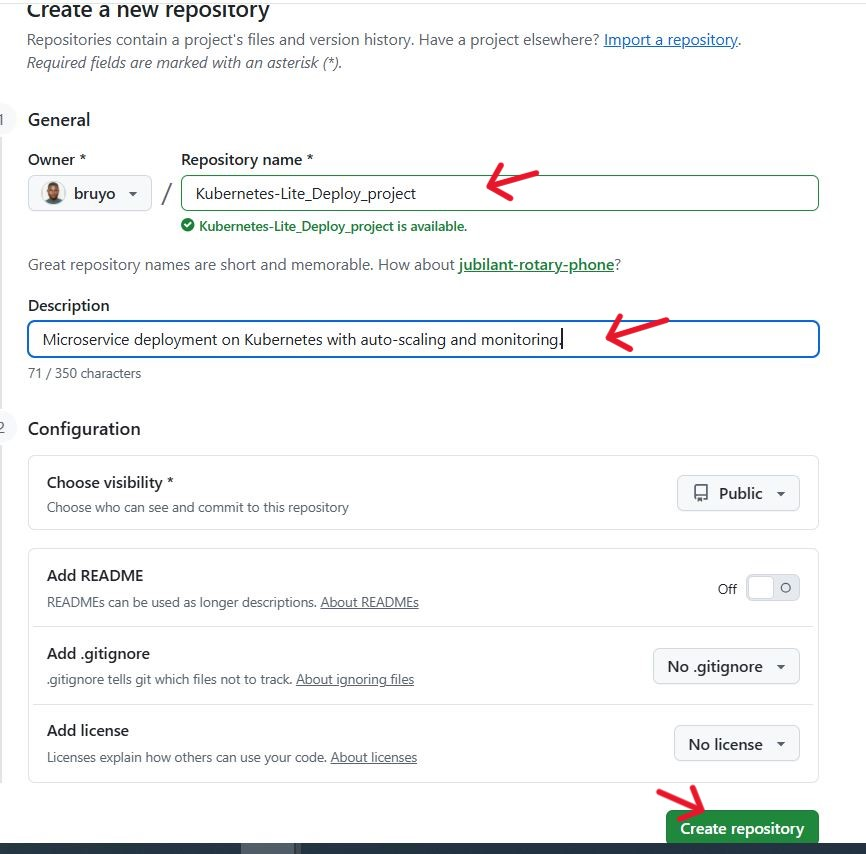

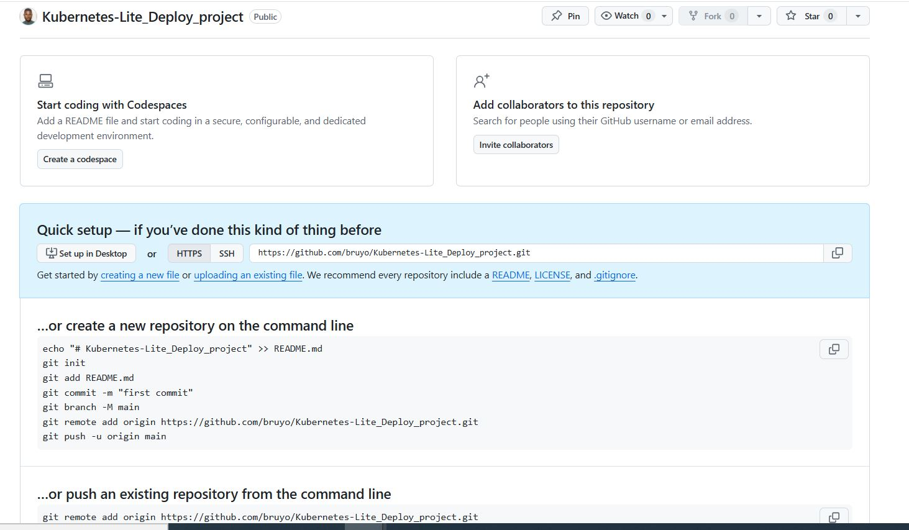

- Initialize git and push changes:

```bash
git init
git add .
git commit -m "first commit"
git branch -M main
git remote add origin https://github.com/bruyo/Kubernetes-Lite_Deploy_project.git
git push -u origin main
```

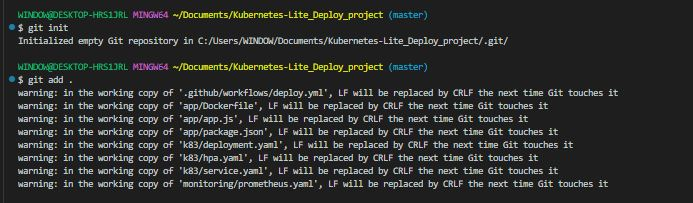

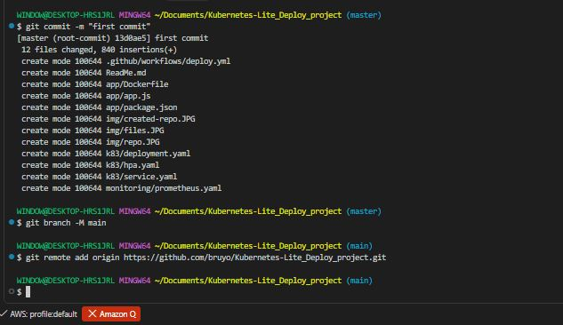

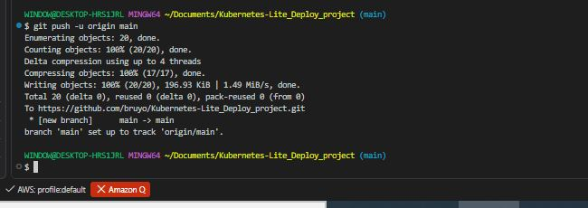


**Create the EKS Cluster using terraform:**

- On the project directory, create a new directory 'terraform'.

```bash
mkdir terraform
cd terraform
nano provider.tf
nano eks.tf
nano variables.tf
nano outputs.tf
nano vpc.tf
```
- terraform/provider.tf

```bash
terraform {
  required_version = ">= 1.5"

  required_providers {
    aws = {
      source  = "hashicorp/aws"
      version = "~> 5.0"
    }
    helm = {
      source  = "hashicorp/helm"
      version = "~> 2.0"
    }
  }

  # Local state by default. For team use, switch to an S3 backend:
  # backend "s3" {
  #   bucket = "your-tfstate-bucket"
  #   key    = "k8s-lite-deploy/terraform.tfstate"
  #   region = "us-west-2"
  # }
}

provider "aws" {
  region = var.aws_region
}

provider "helm" {
  kubernetes {
    host                   = module.eks.cluster_endpoint
    cluster_ca_certificate = base64decode(module.eks.cluster_certificate_authority_data)
    exec {
      api_version = "client.authentication.k8s.io/v1beta1"
      command     = "aws"
      args        = ["eks", "get-token", "--cluster-name", module.eks.cluster_name, "--region", var.aws_region]
    }
  }
}
```

- terraform/eks.tf

```bash
module "eks" {
  source  = "terraform-aws-modules/eks/aws"
  version = "~> 20.0"

  cluster_name    = var.cluster_name
  cluster_version = var.cluster_version

  vpc_id     = module.vpc.vpc_id
  subnet_ids = module.vpc.private_subnets

  cluster_endpoint_public_access = true

  eks_managed_node_groups = {
    default = {
      instance_types = [var.node_instance_type]
      desired_size   = var.node_desired_size
      min_size       = var.node_min_size
      max_size       = var.node_max_size
    }
  }

  # Grants the IAM identity running `terraform apply` cluster-admin access.
  # This is also what CI needs — AWS_ACCESS_KEY_ID/SECRET must belong to
  # this same IAM user/role (or be added via access_entries below).
  enable_cluster_creator_admin_permissions = true
}

# --- metrics-server, addressed in the last chat: fixes the HPA <unknown> targets ---
resource "helm_release" "metrics_server" {
  name       = "metrics-server"
  repository = "https://kubernetes-sigs.github.io/metrics-server/"
  chart      = "metrics-server"
  namespace  = "kube-system"
  version    = "3.12.1"

  depends_on = [module.eks]
}
```

- terraform/vpc.tf

```bash
data "aws_availability_zones" "available" {
  state = "available"
}

module "vpc" {
  source  = "terraform-aws-modules/vpc/aws"
  version = "~> 5.0"

  name = "${var.cluster_name}-vpc"
  cidr = "10.0.0.0/16"

  azs             = slice(data.aws_availability_zones.available.names, 0, 2)
  private_subnets = ["10.0.1.0/24", "10.0.2.0/24"]
  public_subnets  = ["10.0.101.0/24", "10.0.102.0/24"]

  enable_nat_gateway   = true
  single_nat_gateway   = true
  enable_dns_hostnames = true

  # Required tags for the EKS/ALB controller to auto-discover subnets
  public_subnet_tags = {
    "kubernetes.io/role/elb"                     = "1"
    "kubernetes.io/cluster/${var.cluster_name}"  = "shared"
  }
  private_subnet_tags = {
    "kubernetes.io/role/internal-elb"            = "1"
    "kubernetes.io/cluster/${var.cluster_name}"  = "shared"
  }
}
```

- terraform/variables.tf

```bash
variable "aws_region" {
  description = "AWS region to deploy into"
  type        = string
  default     = "us-west-2"
}

variable "cluster_name" {
  description = "EKS cluster name — must match the name used in .github/workflows/deploy.yml"
  type        = string
  default     = "my-kustomize-cluster"
}

variable "cluster_version" {
  description = "Kubernetes version"
  type        = string
  default     = "1.31"
}

variable "node_instance_type" {
  description = "EC2 instance type for worker nodes"
  type        = string
  default     = "t3.medium"
}

variable "node_desired_size" {
  type    = number
  default = 2
}

variable "node_min_size" {
  type    = number
  default = 1
}

variable "node_max_size" {
  type    = number
  default = 3
}
```

- terraform/outputs.tf

```bash
output "cluster_name" {
  value = module.eks.cluster_name
}

output "cluster_endpoint" {
  value = module.eks.cluster_endpoint
}

output "region" {
  value = var.aws_region
}

output "configure_kubectl" {
  value = "aws eks update-kubeconfig --name ${module.eks.cluster_name} --region ${var.aws_region}"
}
```

```bash
cd terraform/
terraform init
terraform plan
terraform apply
```

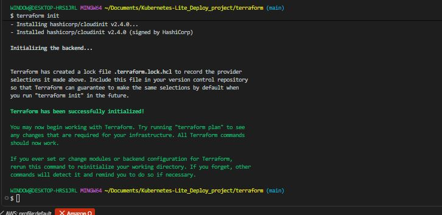

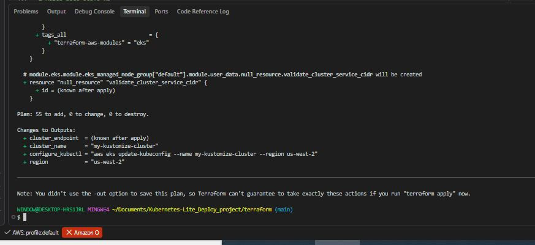

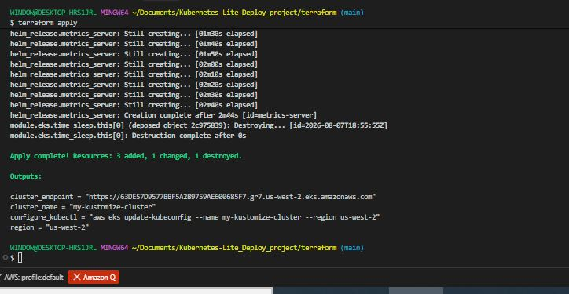


**Demo — Scale the service:**

```bash
# Deploy
kubectl apply -f k8s/

# Check initial state
kubectl get pods
kubectl get hpa

# Generate load to trigger HPA scaling
kubectl run load-generator \
  --image=busybox \
  --restart=Never \
  -- sh -c "while true; do wget -q -O- http://k8s-lite-service/; done"

# Watch pods scale up
kubectl get hpa --watch

# Check metrics endpoint
kubectl port-forward svc/k8s-lite-service 3000:80
curl http://localhost:3000/metrics

# Access Prometheus
kubectl port-forward svc/prometheus 9090:9090
# Open http://localhost:9090

# Stop load
kubectl delete pod load-generator

# Watch pods scale back down
kubectl get pods --watch
```

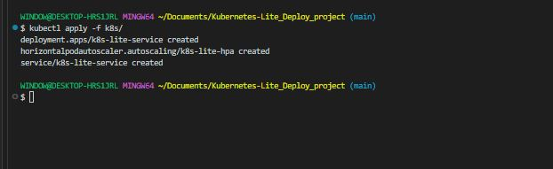

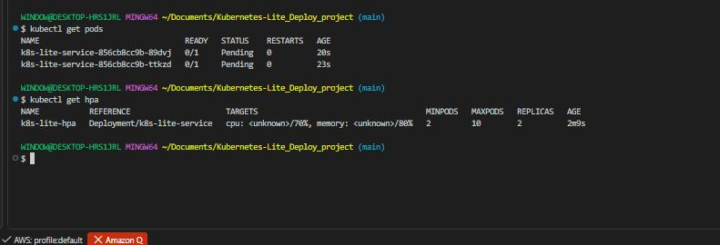

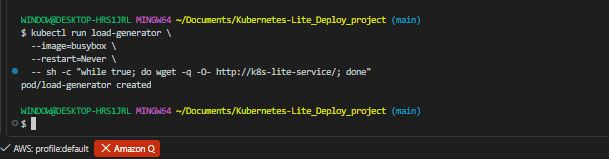

